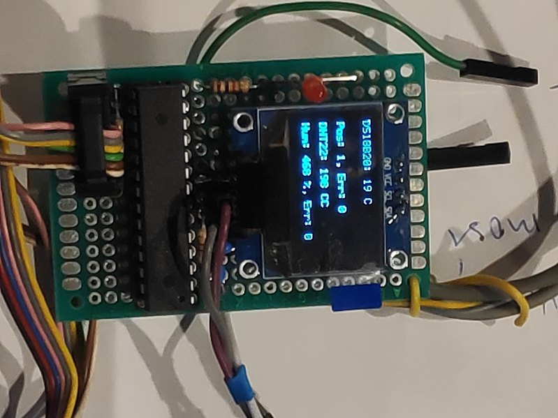
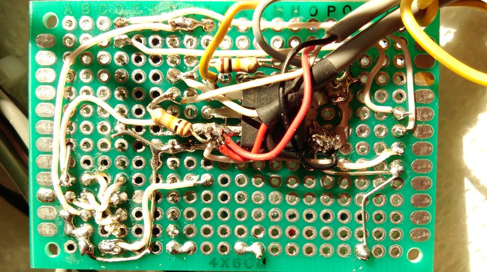

# Non-Blocking Code

This is a custom (soldered) ATmega8 setup with **nonblocking code** to test common sensors DS18B20 and DHT11/22 with a small 128x64 power-economic 
SSD1306 monitor which provides 8 lines each with 21 symbol.

This code might save someone time in finding the correct libs and fitting everything into 5-6KB. Notice that many sensor 
libs use direct datasheet codes which are only preliminary guidelines. They are not suitable for reality yet as they 
are blocking and often deadlocking. **Places with bugs: Check for any code with "while(something)" that does not bail out after 
a fixed number of retries**.

<table>
<tr>
<th style="text-align:center"> Front Side</th>
</tr>
<tr>
<td>

</td>
</tr>
</table>

<table>
<tr>
<th style="text-align:center"> Back Side</th>
</tr>
<tr>
<td>

</td>
</tr>
</table>

# Settings

The fuse bits are set in Makefile such that the clock is internal 1MHz (default), USBasp ISP programmer is employed.

The electric circuit diagram is not provided here, but it is similar to this excellent work:

[https://github.com/protaskin/AVRThermostat](https://github.com/protaskin/AVRThermostat)

The sensor and monitor wiring is the following:

- SSD1306 - SCL PC5, SDA - PC4 (no freedom (!), this uses an internal I2C circuitry in ATmega8). 
- DS18B20 - PD3. 
- DHT22 - PD2, modify however you like in DHT.h.

If you want to change the DS18B20 port letter, just search and replace PORTD, DDRD, PIND in
ds18b20nonblocking.c. The pin number is set in main.c:

```
//DS18b20 is pinned on PD3:
tempS = read_temperature_ds18b20(3);
```

This is useful if multiple DS18B20 sensors are to be added later without the need of their complex ROM 
address scanning. Pinning several sensors on different port letters is not recommended, but this can be 
done with [C++ and metaprogramming][pin-metaprogramming-C++].

Regarding proper licenses, unfortunately [SSD1306] and [I2C] have none, but this should not be a problem. It is amazing that these libs do the job and fit into 5KB, but I do not generally recommend using a display monitor with such tiny devices other than for occasional testing of sensors. Displaying negative floats or changing fonts might get tricky and SSD1306 seems to be used with bigger libs and Raspberry Pi boards that have megabytes of RAM. 

The DS18B20 part is based on a modified old code whose source I can no longer find on github, but see [AVRThermostat-MIT] for the MIT licensed DS18B20 code which also seems to be non-blocking. The DHT code that I use is [DHT22-GPL3], but there is a fairly similar code [DHT22-MIT] which is also supporting both, DHT11 and DHT22 sensors and is also non-blocking. Notably, when using [DHT22-GPL3] with the DHT22 sensor one has to divide the read temperature and humidity values by ten in order to get correct integer value, while the case of DHT11 does the division internally!

In addition to licenses, for massive commercial production one might even need to consider authenticity at the hardware levels, see e.g. [counterfeit_DS18B20]; something similar might be going on with Digispark clones or just about any such device.

To Do: Try to communicate between PC and ATmega8 based on USB and the in-software UART as in 

[https://github.com/toma3757/ATtiny25-DS18B20-UART](https://github.com/toma3757/ATtiny25-DS18B20-UART)

This might allow avoiding any display monitors and their libraries. Notice that monitoring is useful and sometimes LED blinking is not a sufficient "printf", e.g. seeing if the read temperature value needs a division by ten. Negative temperature values seem to be supported in these codes, but I have not tested this scenario.

# References

- [SSD1306]
- [I2C]
- [DHT22-GPL3]
- [DHT22-MIT]
- [AVRThermostat-MIT]
- [pin-metaprogramming-C++]
- [counterfeit_DS18B20]
- [atmega8]

[SSD1306]: https://github.com/Preston-Sundar/AVR-OLED-SSD1306-IIC-DRIVER

[I2C]: https://github.com/Preston-Sundar/AtmegaXX-I2C-Library

[DHT22-GPL3]: https://github.com/fengcda/DHT_Sensor_AVR_Library

[DHT22-MIT]: https://github.com/efthymios-ks/AVR-DHT

[AVRThermostat-MIT]: https://github.com/protaskin/AVRThermostat

[pin-metaprogramming-C++]: https://github.com/ricardocosme/ds18b20

[counterfeit_DS18B20]: https://github.com/cpetrich/counterfeit_DS18B20

[atmega8]: https://ww1.microchip.com/downloads/en/DeviceDoc/Atmel-2486-8-bit-AVR-microcontroller-ATmega8_L_datasheet.pdf


